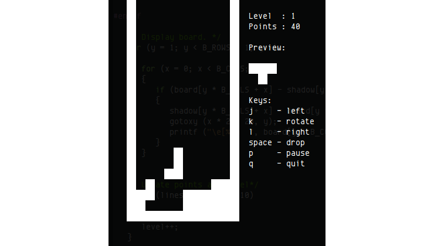

# Tetris  
##

## 선택 이유 및 개요
오픈소스 선택 이유 : 조원 모두 오픈소스를 접한지 오래되지 않았고 오픈소스와 관련된 첫 텀프로젝트이기 때문에 비교적 간단한 오픈소스를 하는 것이 좋겠다고 생각했습니다.  
이 프로그램은 저희가 어렸을적 부터 접해온 게임인 테트리스 게임 프로그램으로 저희처럼 오픈소스를 접한지 오래되지않은 사람이 하기에 적합한 프로그램이 될거라고 생각 했습니다. 이 오픈소스를 해보는것에 있어 좀더 관심있게 참여해 좀더 재밌는 텀프로젝트가 될 것이라는 생각을 했고 또한 지금까지 접했었던 프로그램인 만큼 저희가 원하는 기능이 무었인지 프로그램이 어땠으면 좋겠는지  확실하게 알고 그것들을 테트리스 프로그램에 제안해보고자 이 오픈소스를 선택했습니다.  
  
오픈소스 개요 : C언어를 이용해 개발된 오픈소스로 쉬운 규칙과 간단한 조작으로 가볍게 즐길 수 있는 테트리스 프로그램입니다.  
이 프로그램은  일반 테트리스 게임처럼 ㄴ자,ㅁ자,ㅡ자 등과 같은  다양한 형태의 블록들이 랜덤하게 맨위에서 생성되고 아래로 천천히 떨어집니다. 그 블록들의 방향을 조절하면서 아래로 내려 빈공간을 채워나가는 게임입니다.
## 게임 방법  
각기 다른 모양의 블록이 위에서 아래로 떨어질 때 벌어진 틈에 맞는 블록을  
그 틈에 끼우는 방식의 게임입니다.  
블럭이 쌓여 공백이 없는 줄이 만들어지면 그 줄은 사라집니다.  
블럭이 맨 윗줄까지 쌓이면 패배합니다.
## 각 기능별 설명
- 블럭 이동  
왼쪽으로 한 칸 이동 : j key  
오른쪽으로 한 칸 이동 : l key
- 블럭 회전  
반시계방향 회전 : k key
- 멈춤  
p key
- 종료  
q key
- 블럭 떨어뜨리기  
Space bar  
- level  
블록을 쌓아 10줄을 제거하면 level이 1씩 올라갑니다.
- point  
새 블록이 바닥에 닿을 때마다 point를 1점 획득합니다.  
Space bar 키를 사용해 블럭을 떨어뜨렸을 경우, 블럭과 바닥 사이의 거리만큼  
추가 point를 획득합니다.  

## 기능 향상을 위한 제안
### 1. 회전이 반시계 방향으로만 움직임  
###### 시계방향으로도 움직이게 하면 좋을 것 같음
### 2. 하강속도 조절이 필요함 
###### 하강키를 누르면 한번에 쭉 내려감 
### 3. 레벨업의 기준이 화면에 표시가 안됨
###### 화면에 레벨업에 필요한 라인의 개수 표현이 필요함
### 4. pause상태에서 종료가 안됨
###### 게임을 정지한 상태에서도 게임에서 나갈 수 있어야 함
### 5. 완성된 라인이 제거 될때 한번에 제거되지 않음
###### 동시에 2줄 이상이 완성되었을때 윗줄 부터 차례로 사라짐 동시에 제거 되었으면 더 좋을 것 같음